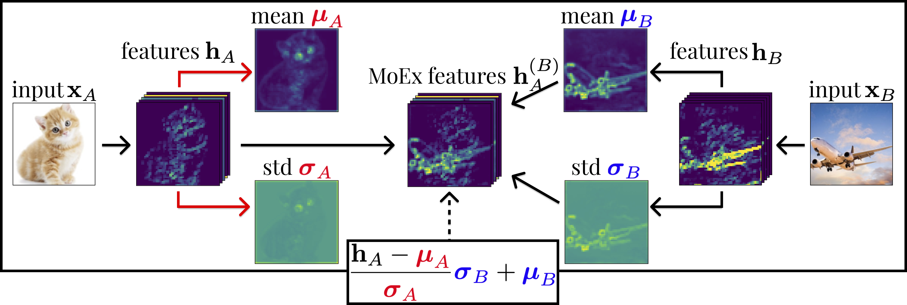

# MoEx (Moment Exchange)
The official PyTorch implementation of the paper [On Feature Normalization and Data Augmentation](https://arxiv.org/abs/2002.11102).

#### Authors: 
* [Boyi Li](https://sites.google.com/site/boyilics/home)*
* [Felix Wu](https://scholar.google.com.tw/citations?user=sNL8SSoAAAAJ&hl=en)*
* [Ser-Nam Lim](https://www.linkedin.com/in/sernam/)
* [Serge Belongie](https://vision.cornell.edu/se3/people/serge-belongie/)
* [Kilian Q. Weinberger](http://kilian.cs.cornell.edu/index.html)

*: Equal Contribution

### Overview
This repo contains the PyTorch implementation of Moment Exchange (MoEx), described in the paper [On Feature Normalization and Data Augmentation](https://arxiv.org/abs/2002.11102). For ImageNet and CIFAR experiments, we select [Positional Normalization (PONO)](https://github.com/Boyiliee/PONO) as the feature normalization method. 



#### Usage
Please follow the instructions in the `README.md` in each subfolder to run experiments with MoEx on [CIFAR](./CIFAR), [ImageNet](./ImageNet), and [ModelNet10/40](./ModelNet).

More information and relevant applications will be updated.

If you find this repo useful, please cite:
```
@article{li2020feature,
  title={On Feature Normalization and Data Augmentation},
  author={Li, Boyi and Wu, Felix and Lim, Ser-Nam and Belongie, Serge and Weinberger, Kilian Q},
  journal={arXiv preprint arXiv:2002.11102},
  year={2020}
}

@inproceedings{li2019positional,
  title={Positional Normalization},
  author={Li, Boyi and Wu, Felix and Weinberger, Kilian Q and Belongie, Serge},
  booktitle={Advances in Neural Information Processing Systems},
  pages={1620--1632},
  year={2019}
}
```